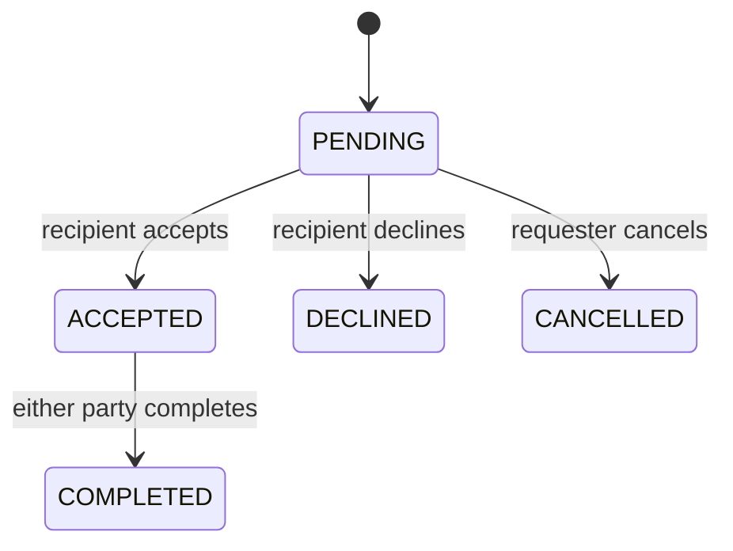

# Architecture

How the app is put together (plan v2 section 8). Requirements are in [requirements.md](requirements.md). Actions are in [api.md](api.md).

## Layers

```
Pages (React Server Components) → server actions → lib/ (rules) → Prisma → Neon Postgres
```

- Pages load data on the server by calling `lib/` read functions.
- Forms post to server actions in `app/actions/`. A server action reads the active user from the cookie, calls one `lib/` function with that actor id, then redirects or returns a message.
- `lib/` functions take the actor id as an argument and return a result object. They don't read cookies. Vitest calls them directly.
- No REST API (decision D3).

## Active user

- Cookie `easy_exchange_user`, HttpOnly, path `/`, SameSite Lax.
- Missing or unknown cookie: the active user is Maya Chen (`user_maya`) once seed has run. If she isn't in the database, there is no active user (404).
- Switching to an unknown id returns 404 and leaves the cookie as it was (FR-002).

## Database

- Neon Postgres through the Vercel integration (decision D1). Prisma uses `DATABASE_URL` (pooled) and `DATABASE_URL_UNPOOLED` (direct, for migrations).
- Schema changes are Prisma migrations in `prisma/migrations/`, applied with `prisma migrate deploy`.
- Tests use `TEST_DATABASE_URL`, a separate Postgres database. Global setup applies the migrations to it and each test file resets and reseeds it (NFR-001). Tests never read `DATABASE_URL`.
- Search uses Prisma `contains` with `mode: "insensitive"` (Postgres is case-sensitive by default).
- Propose runs its reservation check and its insert in one interactive transaction at Serializable isolation, so two proposals for the same book can't both succeed (FR-026-AC7). A serialization failure is returned as 409.
- Complete updates the trade status and both owners in one transaction.

## Covers

- `lib/covers.ts` looks up `https://covers.openlibrary.org/b/isbn/{ISBN}-L.jpg?default=false` when a book is added or its ISBN changes (FR-021). 200 saves the URL without `?default=false`; 404, any other status, a network error, or 3 seconds without an answer saves null.
- Pages never call Open Library. They render the saved `coverUrl` or the placeholder (FR-022, NFR-007).
- Tests replace `fetch` so they don't depend on the network.

## Folders

```
app/
  layout.tsx                header on every page
  page.tsx                  browse: all books, search, filters (FR-007, FR-023, FR-024)
  shelf/page.tsx            my shelf (FR-006)
  books/new/page.tsx        add a book (FR-003, FR-017–FR-019)
  books/[id]/page.tsx       book detail + propose (FR-025, FR-026, FR-034)
  books/[id]/edit/page.tsx  edit and delete (FR-004, FR-005, FR-032)
  books/[id]/not-found.tsx  "That book is not listed."
  trades/page.tsx           trades inbox (FR-027–FR-031, FR-033)
  actions/
    session.ts
    books.ts
    trades.ts
components/
  header.tsx
  book-fields.tsx           every book form control with its label
  book-form.tsx
  book-cover.tsx            cover image or placeholder (FR-022)
  book-card.tsx
  browse-filters.tsx
  propose-form.tsx
  trade-list.tsx
lib/
  prisma.ts
  session.ts
  validation.ts             field and enum validation
  labels.ts                 display labels for enums
  books.ts                  create, update, delete, list, search, get
  covers.ts                 Open Library lookup
  trades.ts                 propose, accept, decline, cancel, complete, list
prisma/
  schema.prisma
  migrations/
  seed.ts
tests/                      Vitest, one test per acceptance criterion
e2e/                        Playwright full swap (NFR-008)
```

## Trade states



No other arrow exists. Any other request is 409 (FR-031). While a trade is PENDING or ACCEPTED, both books are reserved: they can't go on another trade (FR-026), be edited, or be deleted (FR-032). DECLINED, CANCELLED, and COMPLETED release them. COMPLETED also swaps the owners (FR-030).

## Deploy

- Vercel builds every push to `main`: `prisma generate && next build`.
- The live site is https://easy-exchange-rho.vercel.app.
- Migrations and the seed are applied to the production database from a local machine with `prisma migrate deploy` and `prisma db seed`.

## End-to-end test

- `e2e/swap.spec.ts` (Playwright) runs locally against `next dev` on the test database, and once against the live site via `E2E_BASE_URL`.
- The live run adds its own two books, swaps them, then deletes them, so the seeded books are unchanged.
