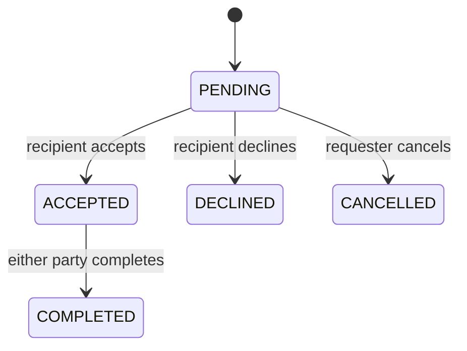

# Architecture

How the MVP is put together. Requirements are in [requirements.md](requirements.md). The trade diagram matches the domain transitions only.

## Layers

Pages and forms call server actions. Server actions read the active user, then call plain functions in `lib/`. Those functions call Prisma. Prisma talks to a SQLite file.

UI → server actions → `lib/` → Prisma → SQLite

`lib/` functions take the actor id as an argument and return a result. They do not read cookies. That split is what the Vitest tests call. Server actions are the only place that read or write the active-user cookie.

## Active user

- Cookie name: `easy_exchange_user`.
- HttpOnly, path `/`.
- If the cookie is missing, or the id is not a user, the active user is Maya Chen (`user_maya`) after seed.
- If that fallback id is not in the database, `getActiveUser` returns 404.
- An explicit switch to an unknown id returns 404 and does not replace the cookie. See FR-002.

## Folders

```
app/
  layout.tsx              header on every page
  page.tsx                all books (FR-007; search arrives in M3)
  shelf/page.tsx          my shelf (FR-006)
  books/new/page.tsx      add a book (FR-003)
  books/[id]/edit/page.tsx
  books/[id]/page.tsx     book detail (FR-010, M3)
  trades/page.tsx         trades inbox (M4)
  actions/
    session.ts
    books.ts
    trades.ts             M4 only
components/
  header.tsx
  book-form.tsx
lib/
  prisma.ts
  session.ts
  books.ts
  trades.ts               M4 only
  validation.ts
prisma/
  schema.prisma           User, Book, and Trade
  seed.ts
tests/
  seed.test.ts
  session.test.ts
  books.test.ts
  forms.test.ts
```

M1 creates the app shell, Prisma schema (including Trade), seed, header, and session helper. `app/page.tsx` in M1 does not list books. Book routes, `books/[id]/page.tsx`, and `trades/page.tsx` are not created yet. The header in M1 has the switcher and no book links.

M2 adds my shelf, add, edit, delete, the unfiltered all-books list on `app/page.tsx`, and header links to those pages. It does not add a search box, a condition filter, book detail, or any trade screen.

## Trade states



No other arrow exists. A request that would draw one returns 409 (FR-016).

While a trade is PENDING or ACCEPTED, both of its books are reserved and cannot be put on a new trade (FR-011). DECLINED, CANCELLED, and COMPLETED release that reservation. COMPLETED also swaps the two owners (FR-015).
