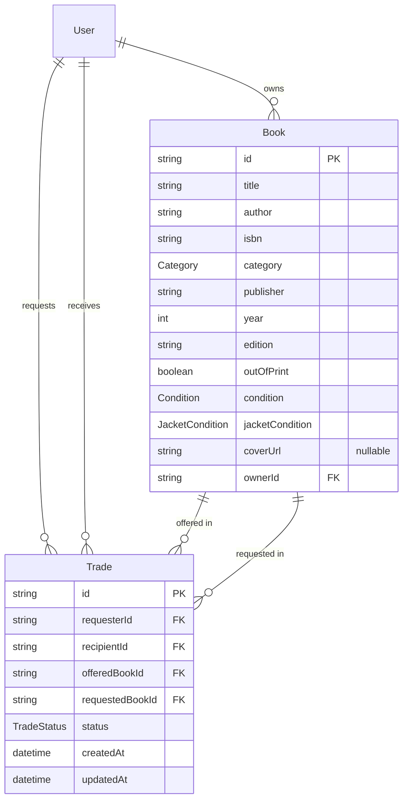

# Data model

Fields for the MVP. Behavior and error codes are in [requirements.md](requirements.md) and [api.md](api.md). Category, condition, jacket condition, and trade status are Postgres enums, not free text.

## User

| Field | Required | Notes |
| --- | --- | --- |
| id | yes | Stable string primary key. |
| name | yes | Display name. |

A user has no password. Real login is Could.

## Book

| Field | Required | Notes |
| --- | --- | --- |
| id | yes | Stable string primary key. Seed ids are `book_01`–`book_12`; new books get `book_` + a UUID. |
| title | yes | Trimmed, non-empty. |
| author | yes | Trimmed, non-empty. |
| isbn | yes | Trimmed, non-empty. No checksum. |
| category | yes | `Category` enum. Replaces v1 `genre`. |
| publisher | yes | Trimmed, non-empty. |
| year | yes | Whole number from 1450 to the current year. |
| edition | no | Trimmed free text, e.g. "1st ed.". Blank is stored as an empty string and shown as "—". |
| outOfPrint | yes | Boolean. Defaults to false. |
| condition | yes | `Condition` enum. |
| jacketCondition | yes | `JacketCondition` enum. |
| coverUrl | no | Open Library cover URL, or null when there is no cover. Set by the app (FR-021), never by the form. |
| ownerId | yes | Exactly one User. |

The client does not set `ownerId` on create or change it on edit (NFR-005). The client does not set `coverUrl` (FR-021).

## Enums

| Enum | Value | Label shown |
| --- | --- | --- |
| Category | ARCHITECTURE_MONOGRAPH | Architecture Monograph |
| Category | ARCHITECTURAL_THEORY | Architectural Theory |
| Category | ART_HISTORY | Art History |
| Category | EXHIBITION_CATALOGUE | Exhibition Catalogue |
| Category | PHOTOGRAPHY | Photography |
| Category | DESIGN | Design |
| Category | ARTIST_BOOK_ZINE | Artist Book / Zine |
| Condition | NEW | New |
| Condition | LIKE_NEW | Like New |
| Condition | GOOD | Good |
| Condition | FAIR | Fair |
| Condition | POOR | Poor |
| JacketCondition | NONE | None (no jacket) |
| JacketCondition | POOR | Poor |
| JacketCondition | FAIR | Fair |
| JacketCondition | GOOD | Good |
| JacketCondition | FINE | Fine |
| TradeStatus | PENDING, ACCEPTED, DECLINED, CANCELLED, COMPLETED | Pending, Accepted, Declined, Cancelled, Completed |

## Trade

| Field | Required | Notes |
| --- | --- | --- |
| id | yes | Primary key (cuid). |
| requesterId | yes | User who proposes. Owns `offeredBookId` at creation. |
| recipientId | yes | User who owns `requestedBookId` at creation. |
| offeredBookId | yes | The requester's book. |
| requestedBookId | yes | The recipient's book. |
| status | yes | `TradeStatus` enum. |
| createdAt | yes | Set on create. |
| updatedAt | yes | Set on create and on every status change. |

`offeredBookId` and `requestedBookId` are different books. `requesterId` and `recipientId` are different users.

## Relationships

- A user owns zero or more books. A book has one owner.
- A user requests zero or more trades and receives zero or more trades.
- A book is the offered or requested book on zero or more trades. At most one of those trades is PENDING or ACCEPTED at a time (the reservation rule, FR-026).
- When a book is deleted, its closed trades (DECLINED, CANCELLED, COMPLETED) are deleted with it. A reserved book can't be deleted (FR-032).

## Seed

Ids are fixed so tests can refer to them. The seed creates no trades.

| id | name |
| --- | --- |
| user_maya | Maya Chen |
| user_jordan | Jordan Hale |
| user_sam | Sam Rivera |

Books, from plan v2 section 9. Edition "—" is stored as an empty string.

| id | owner | title | author | publisher | year | edition | isbn | category | condition | jacket | out of print | cover |
| --- | --- | --- | --- | --- | --- | --- | --- | --- | --- | --- | --- | --- |
| book_01 | user_maya | Toward an Architecture | Le Corbusier | Getty Research Institute | 2007 | — | 0892368225 | ARCHITECTURAL_THEORY | GOOD | NONE | no | yes |
| book_02 | user_maya | Thinking with Type | Ellen Lupton | Princeton Architectural Press | 2010 | 2nd rev. ed. | 1568989695 | DESIGN | LIKE_NEW | NONE | no | yes |
| book_03 | user_maya | Ways of Seeing | John Berger | Penguin | 1990 | — | 0140135154 | ART_HISTORY | FAIR | NONE | no | yes |
| book_04 | user_maya | On Photography | Susan Sontag | Picador | 2001 | — | 0312420099 | PHOTOGRAPHY | GOOD | NONE | no | yes |
| book_05 | user_jordan | S, M, L, XL | Rem Koolhaas, Bruce Mau | Monacelli Press | 1995 | 1st ed. | 1885254016 | ARCHITECTURE_MONOGRAPH | GOOD | NONE | no | yes |
| book_06 | user_jordan | Delirious New York | Rem Koolhaas | Monacelli Press | 1994 | New ed. | 1885254008 | ARCHITECTURAL_THEORY | LIKE_NEW | GOOD | no | yes |
| book_07 | user_jordan | Deconstructivist Architecture | Philip Johnson, Mark Wigley | Museum of Modern Art | 1988 | 1st ed. | 087070298X | EXHIBITION_CATALOGUE | GOOD | NONE | yes | yes |
| book_08 | user_jordan | Learning from Las Vegas | Robert Venturi, Denise Scott Brown, Steven Izenour | MIT Press | 1972 | 1st ed. | 0262220156 | ARCHITECTURAL_THEORY | FAIR | POOR | yes | no |
| book_09 | user_sam | The Story of Art | E. H. Gombrich | Phaidon | 1995 | 16th ed. | 0714832472 | ART_HISTORY | GOOD | GOOD | no | yes |
| book_10 | user_sam | Uncommon Places | Stephen Shore | Aperture | 2005 | Revised ed. | 1931788340 | PHOTOGRAPHY | NEW | FINE | no | yes |
| book_11 | user_sam | Grid Systems in Graphic Design | Josef Müller-Brockmann | Niggli | 1996 | 4th rev. ed. | 3721201450 | DESIGN | LIKE_NEW | NONE | no | yes |
| book_12 | user_sam | Twentysix Gasoline Stations | Michalis Pichler | Printed Matter | 2009 | — | 0894390449 | ARTIST_BOOK_ZINE | POOR | NONE | no | no |

The M3 migration that replaces `genre` with `category` deletes every trade and book first (approved by Ali, 2026-10-06), because v1 rows have no category. The seed then loads the books above.

"cover yes" means the seed stores `https://covers.openlibrary.org/b/isbn/{isbn}-L.jpg` as `coverUrl`. "cover no" stores null. The seed does not call Open Library; plan v2 section 9 records that the covers were checked on 2026-10-06.
