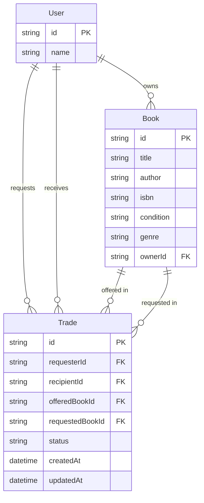

# Data model

Fields for the MVP. Behavior and error codes are in [requirements.md](requirements.md) and [api.md](api.md). Unresolved points stay in that file's Open Questions section.

## User

| Field | Required | Notes |
| --- | --- | --- |
| id | yes | Stable string primary key. |
| name | yes | Display name. |

A user does not have a password. Real login is later.

## Book

| Field | Required | Notes |
| --- | --- | --- |
| id | yes | Stable string primary key. |
| title | yes | Trimmed, non-empty. |
| author | yes | Trimmed, non-empty. |
| isbn | yes | Trimmed, non-empty. No checksum. |
| condition | yes | NEW, LIKE_NEW, GOOD, FAIR, or POOR. |
| genre | yes | Trimmed, non-empty free text. |
| ownerId | yes | Exactly one User. |

The client does not get to set `ownerId` on create or change it on edit. See NFR-005.

## Trade

Stored in M1. No trade actions until M4.

| Field | Required | Notes |
| --- | --- | --- |
| id | yes | Primary key. |
| requesterId | yes | User who proposes. Owns `offeredBookId` at creation. |
| recipientId | yes | User who owns `requestedBookId` at creation. |
| offeredBookId | yes | One book the requester offers. |
| requestedBookId | yes | One book the requester wants. |
| status | yes | PENDING, ACCEPTED, DECLINED, CANCELLED, or COMPLETED. |
| createdAt | yes | Set when the trade is created. |
| updatedAt | yes | Set when the trade is created and when the status changes. |

`offeredBookId` and `requestedBookId` are two different books. `requesterId` and `recipientId` are two different users.

## Relationships

- A user owns zero or more books. A book has one owner.
- A user requests zero or more trades and receives zero or more trades.
- A book is the offered book on zero or more trades and the requested book on zero or more trades.
- At most one of those trades may be PENDING or ACCEPTED for a given book. That limit is a rule in FR-011, not an extra table.

## Seed

Ids are fixed so tests can refer to them.

| id | name |
| --- | --- |
| user_maya | Maya Chen |
| user_jordan | Jordan Hale |
| user_sam | Sam Rivera |

| id | owner | title | author | isbn | condition | genre |
| --- | --- | --- | --- | --- | --- | --- |
| book_01 | user_maya | Clean Code | Robert C. Martin | 9780132350884 | GOOD | Software |
| book_02 | user_maya | The Pragmatic Programmer | David Thomas | 9780135957059 | LIKE_NEW | Software |
| book_03 | user_maya | Introduction to Algorithms | Thomas H. Cormen | 9780262046305 | FAIR | Computer Science |
| book_04 | user_maya | Designing Data-Intensive Applications | Martin Kleppmann | 9781449373320 | NEW | Computer Science |
| book_05 | user_jordan | Calculus | James Stewart | 9781285740621 | GOOD | Mathematics |
| book_06 | user_jordan | Linear Algebra Done Right | Sheldon Axler | 9783319110790 | LIKE_NEW | Mathematics |
| book_07 | user_jordan | A Brief History of Time | Stephen Hawking | 9780553380163 | GOOD | Science |
| book_08 | user_jordan | The Structure of Scientific Revolutions | Thomas Kuhn | 9780226458120 | FAIR | History |
| book_09 | user_sam | Campbell Biology | Lisa Urry | 9780134093413 | POOR | Biology |
| book_10 | user_sam | The Gene | Siddhartha Mukherjee | 9781476733524 | GOOD | Biology |
| book_11 | user_sam | Ways of Seeing | John Berger | 9780140135152 | LIKE_NEW | Art |
| book_12 | user_sam | Thinking, Fast and Slow | Daniel Kahneman | 9780374533557 | NEW | Psychology |

The seed creates no trades.
